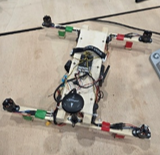
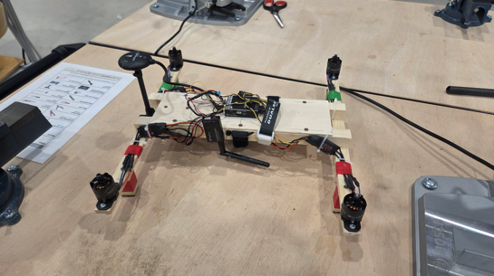
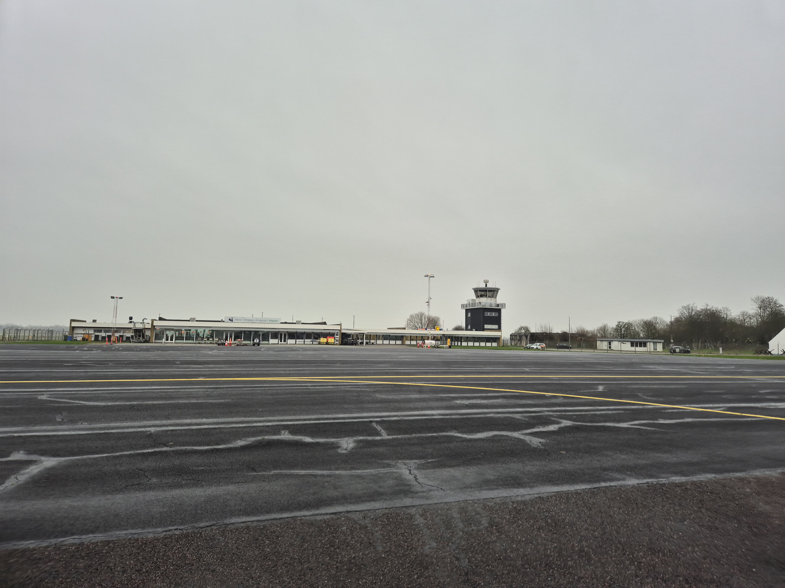
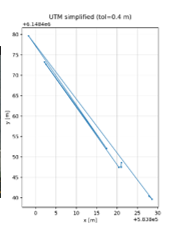
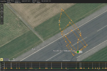
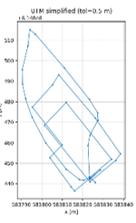
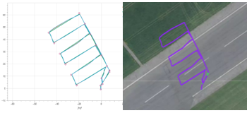
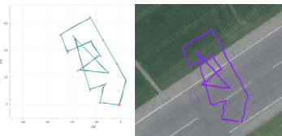

# Module 9-12: quadrotor build and GNSS waypoint autonomy

This repo-style article condenses our module 9-12 work for **Introduction to Drone Technology (IDT)** (*Drones and Autonomous Systems*, University of Southern Denmark).

We built a quadrotor, configured it in **QGroundControl**, and tested:
- Manual and stabilized flight for bring-up and safety
- Outdoor GNSS assisted flight (position hold behavior)
- Autonomous waypoint missions using GNSS navigation

## Goals

- Simple and robust airframe that is easy to iterate on
- Balanced weight distribution for predictable control
- Reliable GNSS assisted modes outdoors
- Waypoint mission execution with logged trajectories for analysis

## Drone design and construction

We used an **H-frame** quadrotor layout for symmetry, clear motor spacing, and easier weight balancing.

Build highlights:
- Four brushless motors with paired CW and CCW propellers to cancel net torque
- Power distribution from a **4S 5000 mAh LiPo** to the ESCs and flight controller
- Battery placed near the geometric centre of the frame and secured with Velcro straps
- Landing legs near the motors to absorb landing impacts

**Build photos**

## System architecture

High-level flow:
1. LiPo battery powers the power distribution board.
2. The distribution board powers the ESCs and the flight controller.
3. The flight controller commands each ESC to regulate motor thrust.
4. Onboard sensors (IMU, GNSS, etc.) are fused for attitude and position estimation.

## QGroundControl configuration

Configuration steps we followed:
- Select **Quadcopter (X configuration)**
- Calibrate sensors (gyro, accelerometer, compass, level horizon)
- Calibrate the radio controller and verify channel mapping
- Assign flight modes to a switch
- Configure and test a **kill switch**

Practical note: a bad level horizon calibration can look like unexplained drift, so calibration conditions matter.

## Flight testing

### Indoor testing

First flights were conducted indoors in a drone safety cage to reduce risk. We verified motor order, prop direction, RC mapping, and basic hover stability.

A hard landing damaged a telemetry antenna that was too close to moving parts, so it was replaced and repositioned.

### Outdoor test site

Outdoor tests were performed on an airfield landing strip.

### Outdoor GNSS assisted manual flights

We flew in a GNSS assisted mode (pilot commands movement, controller holds position) and collected tracks for analysis.

**Straight out-and-back test**

**Rectangular pattern test**

### Autonomous waypoint missions

Autonomous tests were run after confirming correct behavior in manual GNSS assisted mode.

Typical observations:
- The trajectory matched the waypoint structure overall
- Deviations were most visible around turns and waypoint transitions
- Waypoint acceptance radius and controller dynamics can trigger turns before full convergence to the waypoint

**Example mission overlays**

## Trajectory data and post-processing

We projected GNSS to **UTM** coordinates for clearer plotting and comparison. We also experimented with trajectory simplification using tolerance values around **0.4 m to 0.5 m** to reduce point density while preserving overall path geometry.

## Lessons learned

- Symmetric frame layout and central battery placement helped stability and repeatability.
- Calibration quality (especially level horizon) had a big impact on hover and position behavior.
- Hardware placement matters. Keep antennas and wiring away from propellers and likely impact paths.
- GNSS noise and wind are usually the dominant sources of small position errors.
